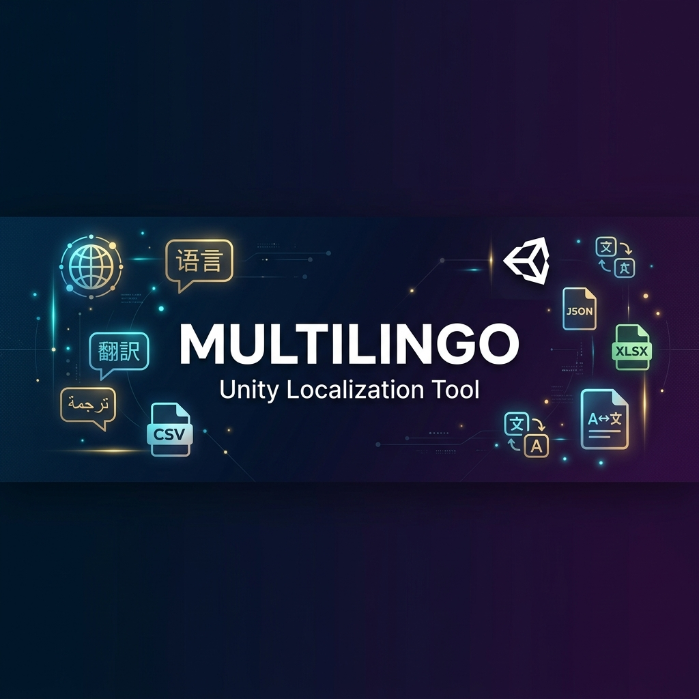

<p align="center">
  
</p>

<h1 align="center">🌍 MultiLingo — Localization Converter & Tools for Unity</h1>

<p align="center">
  <strong>The ultimate all-in-one localization toolkit for Unity developers.</strong><br/>
  Translate, convert, sync, and manage your game's localization — all from within the Unity Editor.
</p>

<p align="center">
  <a href="#-features"></a>
  <a href="#-supported-formats"></a>
  <a href="#-installation"></a>
  <a href="https://buymeacoffee.com/logic_builder"></a>
</p>

---

## 📖 Overview

**MultiLingo** eliminates the pain of game localization. Instead of switching between dozens of external tools, spreadsheets, and manual copy-pasting, MultiLingo lets you do everything from a single Unity Editor window:

- 🌐 **Translate** your game text into **100+ languages** using Google, OpenAI (ChatGPT), or DeepL
- 🔄 **Convert** between CSV, XLSX, JSON, XML, and YAML formats instantly
- 🎙️ **Generate voice-overs** automatically using AI text-to-speech
- 🔗 **Sync** with Unity's official Localization system and Google Sheets
- 🔠 **Optimize** CJK font files to reduce build size dramatically

---

## ✨ Features

### 🌐 Converter & Translator Engine

| Feature | Description |
|---|---|
| **AI Translation** | Translate spreadsheets into 100+ languages using Google, OpenAI, DeepL, or Google Cloud |
| **Format Conversion** | Seamlessly convert between CSV ↔ XLSX ↔ JSON ↔ XML ↔ YAML |
| **Batch Processing** | Translate multiple files simultaneously with a single click |
| **Translation Caching** | Smart memory — previously translated strings are remembered, saving time & API costs |
| **Quality Validation** | Automatic warnings for missing translations and text length issues |
| **Context-Aware AI** | Provide project name & description so AI understands the context of your game |

### 🛠️ Unity Localization Tools

| Tool | Description |
|---|---|
| **🎙️ Auto Voice-Over (TTS)** | Generate realistic voice audio files for all dialogue lines in every language using OpenAI TTS |
| **🔍 Missing Keys Translator** | Scan Unity String Tables and auto-translate only the missing entries |
| **🔗 Two-Way Sync** | Import spreadsheets into Unity's Localization system or export String Tables to CSV |
| **💻 C# Keys Generator** | Auto-generate a type-safe C# class from your localization keys (e.g., `LocalizationKeys.PLAY_BUTTON`) |
| **🔎 Scene Text Scanner** | Scan your scene for all UI text and export it as a ready-to-translate spreadsheet |
| **☁️ Google Sheets Sync** | Live-sync your game text from a public Google Sheet URL |
| **🔠 CJK Font Optimizer** | Extract only the characters your game uses from massive CJK fonts — shrink 30 MB fonts to KBs |
| **🌍 Auto Localizer** | Automatically scan scenes for text, generate unique keys, and link UI components to localization tables |
| **📋 List Importer** | Bulk-import raw name lists directly into Unity String Tables |

### 🎮 Runtime Components

| Component | Description |
|---|---|
| **LocalizedText** | Drop-on component that automatically updates UI text when the player changes language |
| **LocaleFontSwitcher** | Automatically swaps fonts per locale (e.g., use a CJK font for Japanese, Latin font for English) |
| **LanguageDropdownUI** | Ready-made language selection dropdown for your settings menu |
| **LocalizationManager** | Lightweight runtime manager for locale switching and initialization |

---

## 📦 Installation

### Option 1: Import into Your Project
1. Download or clone this repository.
2. Copy the `Assets/Multilingo_Localization_Converter` folder into your Unity project's `Assets` directory.
3. A **Setup Wizard** will appear automatically to install any missing dependencies.

### Option 2: Manual Dependency Setup
If the wizard doesn't appear, go to `Tools > Multilingo > Welcome Window` and click **🔍 Manage Dependencies**.

### Required Dependencies
| Package | Minimum Version |
|---|---|
| Unity Localization | 1.4.5+ |
| TextMeshPro | — |
| Addressables | — |

> **Note:** Requires **Unity 2020.3** or higher.

---

## 🚀 Quick Start

### Translating a Spreadsheet
1. Open Unity → `Tools > Multilingo > Localization Converter`
2. Set mode to **Translator**
3. Drag & drop your `.csv` or `.xlsx` file
4. Select the source language column
5. Check the target languages you want
6. Choose your AI provider (Google Free, OpenAI, DeepL, or Google Cloud)
7. Click **Start Processing** — done! 🎉

### Converting File Formats
1. Open Unity → `Tools > Multilingo > Localization Converter`
2. Set mode to **Converter**
3. Drag & drop your input file
4. Select the desired output format
5. Click **Start Processing** and save

### Using Unity Localization Tools
1. Open Unity → `Tools > Multilingo > Unity Localization Utilities`
2. Navigate between tabs: Voice-Over, Missing Keys, Sync, Code Generator, Scene Scanner, Google Sheets, Font Optimizer
3. Each tab has clear instructions built right into the UI

---

## 📁 Supported Formats

| Format | Import | Export |
|:---:|:---:|:---:|
| CSV (`.csv`) | ✅ | ✅ |
| Excel (`.xlsx`) | ✅ | ✅ |
| JSON (`.json`) | ✅ | ✅ |
| XML (`.xml`) | ✅ | ✅ |
| YAML (`.yaml`) | ✅ | ✅ |

---

## 🤖 Supported AI Translation Providers

| Provider | Free? | API Key Required? | Best For |
|---|:---:|:---:|---|
| **Google Free** | ✅ Yes | ❌ No | Small projects, quick tests |
| **OpenAI (ChatGPT)** | ❌ Paid | ✅ Yes | Context-aware, natural translations |
| **DeepL** | ❌ Paid | ✅ Yes | European languages, high accuracy |
| **Google Cloud** | ❌ Paid | ✅ Yes | Production-grade, high volume |

---

## 📂 Project Structure

```
Assets/Multilingo_Localization_Converter/
├── Editor/                          # All editor-only tools & windows
│   ├── Core/                        # Core translation & conversion engine
│   ├── Installer/                   # Dependency auto-installer
│   ├── MultilingoConverterWindow.cs # Main converter/translator window
│   ├── MultilingoLocalizationTools.cs # Unity localization utilities
│   ├── MultilingoWelcomeWindow.cs   # Setup wizard & welcome screen
│   └── ...
├── Runtime/                         # Runtime components for your game
│   ├── LocalizedText.cs             # Auto-updating localized text
│   ├── LocaleFontSwitcher.cs        # Per-locale font switching
│   ├── LanguageDropdownUI.cs        # Language selection dropdown
│   ├── LocalizationManager.cs       # Runtime locale manager
│   └── ...
├── Documentation.md                 # Full beginner-friendly documentation
├── INSTALLATION.md                  # Detailed installation guide
├── README.md                        # Package README
└── package.json                     # Unity package manifest
```

---

## ❓ FAQ & Troubleshooting

<details>
<summary><strong>"API Key Invalid" error</strong></summary>

99% of the time, there's an invisible space at the beginning or end of your API key. Go to the settings box in MultiLingo, click inside the field, and remove any trailing/leading spaces.
</details>

<details>
<summary><strong>Translations stopped working (Google Free)</strong></summary>

Google Free has rate limits. If you translate too many words in a short time, Google temporarily blocks requests. Wait 1–2 hours, or switch to OpenAI/DeepL for large projects.
</details>

<details>
<summary><strong>Red errors after import</strong></summary>

This usually means Unity Localization is missing. Use `Tools > Multilingo > Welcome Window` → **Manage Dependencies** to install it automatically.
</details>

<details>
<summary><strong>Translation is slow</strong></summary>

Translating 10,000+ words into 15+ languages requires significant AI processing. This is normal — let it run. It's still infinitely faster than manual translation!
</details>

---

## 🤝 Contributing

Contributions, issues, and feature requests are welcome! Feel free to:

1. **Fork** this repository
2. Create your feature branch (`git checkout -b feature/amazing-feature`)
3. Commit your changes (`git commit -m 'Add amazing feature'`)
4. Push to the branch (`git push origin feature/amazing-feature`)
5. Open a **Pull Request**

---

## ☕ Support the Project

If MultiLingo has saved you time and made your localization workflow easier, consider supporting the development!

<p align="center">
  <a href="https://buymeacoffee.com/logic_builder">
    
  </a>
</p>

<p align="center">
  Your support helps keep this project actively maintained and growing with new features! ❤️
</p>

---

## 📄 License

This project is provided as-is for use in Unity projects. See individual files for any specific license details.

---

<p align="center">
  Made with ❤️ by <a href="https://github.com/presentingtech"><strong>Presenting Tech</strong></a>
</p>

<p align="center">
  <em>Building a game that the whole world can understand is now easier than ever. 🚀</em>
</p>
